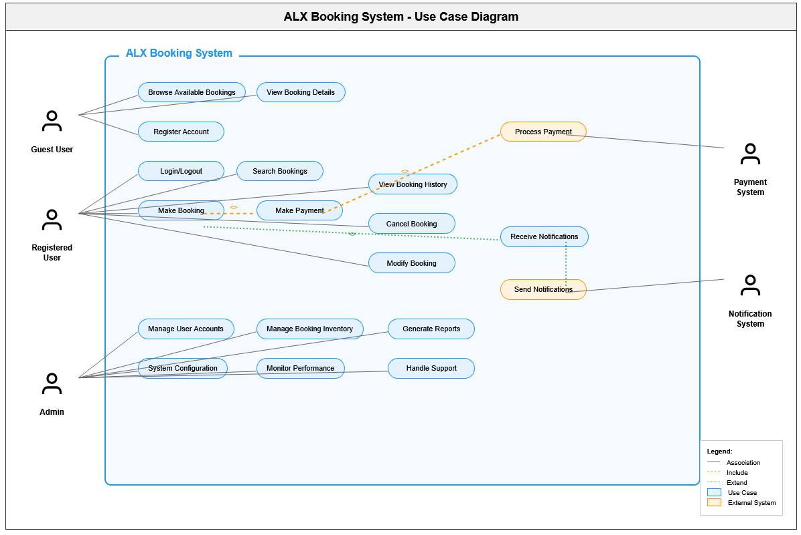

# Requirement Analysis in Software Development

## Introduction

This repository is dedicated to exploring the process of requirement analysis in software development. Requirement analysis is a crucial phase that involves gathering, evaluating, and documenting the needs and expectations of stakeholders for a software project. The purpose of this repository is to provide resources, examples, and best practices to help teams effectively manage requirements and ensure successful project outcomes.

## What is Requirement Analysis?

Requirement Analysis is the process of identifying, gathering, and defining the needs and expectations of stakeholders for a software project. It is a foundational phase in the Software Development Lifecycle (SDLC) that sets the stage for successful project execution. The primary objective of requirement analysis is to ensure that all stakeholders have a clear understanding of what the software should achieve, which helps avoid misunderstandings and costly changes later in the development process.

During requirement analysis, stakeholders such as clients, users, developers, and business analysts collaborate to specify functional and non-functional requirements. This process often involves various techniques, including interviews, surveys, document analysis, use case development, and prototyping.

**Importance in the Software Development Lifecycle (SDLC):**
- Requirement analysis helps ensure the final product meets the needs of its users and aligns with business goals.
- It minimizes project risks by identifying potential issues early.
- Well-defined requirements serve as a basis for system design, development, testing, and validation.
- It facilitates communication and consensus among stakeholders, leading to more predictable project outcomes.
- Proper requirement analysis reduces the likelihood of project scope creep and helps control costs and timelines.

In summary, requirement analysis is critical to delivering high-quality software that fulfills stakeholder expectations and contributes to overall project success.

## Key Activities in Requirement Analysis

Requirement Analysis involves several critical activities that ensure the software meets stakeholders' needs and expectations. The five key activities are:

- **Requirement Gathering:**  
  Collecting information from stakeholders to understand their needs, expectations, and constraints for the software. This may involve interviews, surveys, questionnaires, and reviewing existing documentation.

- **Requirement Elicitation:**  
  Discovering and uncovering actual requirements through direct interaction with stakeholders. Techniques include workshops, brainstorming sessions, observation, and prototyping to clarify ambiguous needs.

- **Requirement Documentation:**  
  Systematically recording the gathered and elicited requirements in a structured format. Documentation ensures requirements are clear, consistent, and accessible to all project members, typically using use cases, user stories, or requirements specifications.

- **Requirement Analysis and Modeling:**  
  Examining, organizing, and refining requirements to resolve conflicts and ambiguities. Modeling helps visualize requirements using diagrams, flowcharts, or models, making them easier to understand and validate.

- **Requirement Validation:**  
  Checking and verifying that documented requirements accurately represent stakeholders’ needs and are feasible for implementation. Validation may include reviews, walkthroughs, and prototype demonstrations to ensure completeness and correctness.

## Types of Requirements

Requirements in software development are categorized into two main types: Functional and Non-functional Requirements. Below are definitions and examples for each, based on a booking management project.

### Functional Requirements

Functional requirements specify what the system should do—its features, behaviors, and interactions. They describe the tasks, functions, and operations the software must perform to meet user needs.

**Examples for a Booking Management Project:**
- Users can search for available booking slots by date and location.
- The system allows users to create, modify, and cancel bookings.
- Administrators can view, approve, or reject booking requests.
- The system sends confirmation emails to users after successful booking.
- Users can view their booking history and upcoming reservations.

### Non-functional Requirements

Non-functional requirements define how the system performs its functions. They include quality attributes like performance, security, usability, reliability, and scalability.

**Examples for a Booking Management Project:**
- The system should respond to booking requests within 2 seconds.
- User data must be encrypted at rest and in transit.
- The application must be accessible from mobile devices and desktops.
- The system should support up to 10,000 concurrent users without performance degradation.
- The booking service must be available 99.9% of the time.

## Use Case Diagrams

Use Case Diagrams are visual representations used in requirement analysis to illustrate the interactions between users (actors) and the system’s functionalities (use cases). They help stakeholders understand how different users will interact with the system, clarify requirements, and identify the boundaries of the system.

**Benefits of Use Case Diagrams:**
- Simplify complex requirements by presenting them visually.
- Facilitate communication among stakeholders.
- Help identify system actors, use cases, and their relationships.
- Serve as a basis for creating detailed requirements and test cases.

### Example: Booking System Use Case Diagram

Below is a use case diagram for a booking management system, showing the main actors and use cases:

**Actors:**
- User
- Administrator

**Use Cases:**
- Search Booking Slots
- Create Booking
- Modify Booking
- Cancel Booking
- View Booking History
- Approve/Reject Booking (Administrator)
- Receive Confirmation Email

## Acceptance Criteria

Acceptance Criteria are specific, measurable conditions that a software feature must satisfy to be considered complete and acceptable by stakeholders. They play a critical role in Requirement Analysis by clarifying expectations, guiding development and testing, and ensuring that features align with user needs and business goals.

**Importance of Acceptance Criteria in Requirement Analysis:**
- Define clear boundaries for what constitutes the completion of a feature.
- Help prevent misunderstandings between stakeholders, developers, and testers.
- Facilitate the creation of test cases and ensure that requirements are verifiable.
- Support efficient communication and foster shared understanding within the project team.
- Reduce the risk of scope creep and rework by establishing precise requirements.

### Example: Acceptance Criteria for Checkout Feature (Booking Management System)

1. The user must be able to view a summary of their booking before proceeding to checkout.
2. The checkout page must display the total cost, including taxes and any applicable discounts.
3. The system must support payment via credit card, debit card, and PayPal.
4. Upon successful payment, the user should receive a confirmation email with booking details.
5. If payment fails, the user should receive a clear error message and be given the option to retry or choose a different payment method.
6. The booking status should update to “Confirmed” only after payment is successfully processed.
7. The checkout process must be completed within 2 minutes, or the booking session should expire and notify the user.

Acceptance Criteria ensure that the delivered features meet the stakeholders’ expectations and are ready for release.

